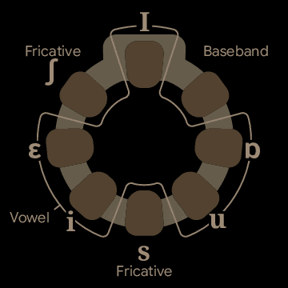

# Audio-to-Tactile Representation

(This is not an official Google product.)

**Audio-to-Tactile** is a project about audio-to-tactile representations. We
developed a wearable tactile device that aims to enables users to *feel*
sound in a natural and useful way, especially in understanding speech and
complementing lip reading.

If you are interested and have ideas about using our hardware or want to receive
updates, please fill out [this
form](https://sites.google.com/corp/view/vhp-collaborations/home).

**Slim v0.4 bracelet**

**Live web demo (click to open)**

## License
This code uses the Apache License 2.0. See the LICENSE file for details.

## Documentation

* [Hardware](extras/doc/hardware/index.md)
* [Firmware](extras/doc/firmware/index.md)
* [Mechanical](extras/doc/mechanical/index.md)
* [Android app](extras/doc/android_app/index.md)
* [Signal processing](extras/doc/signal_processing/index.md)
  * [Energy envelope](extras/doc/signal_processing/energy_envelope/index.md)
  * [Frontend](extras/doc/signal_processing/frontend/index.md)
  * [Vowel embedding](extras/doc/signal_processing/vowel_embedding/index.md)
  * [References](extras/doc/signal_processing/references/index.md)
      * [TAPS](extras/doc/signal_processing/references/taps/index.md)
      * [Bratakos et al. 2001](extras/doc/signal_processing/references/bratakos2001/index.md)
      * [Yuan et al. 2005](extras/doc/signal_processing/references/yuan2005/index.md)
* [Perceptual measurements](extras/doc/perceptual_measurements/index.md)
* [Tools](extras/doc/tools/index.md)
  * [flash_firmware](extras/doc/tools/flash_firmware/index.md)
  * [play_buzz](extras/doc/tools/play_buzz/index.md)
  * [Tactometer](extras/doc/tools/tactometer/index.md)

## Mailing list
audio-to-tactile-maintainers@google.com
