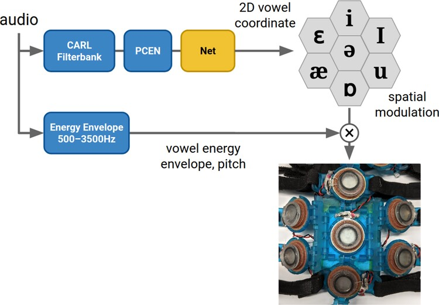
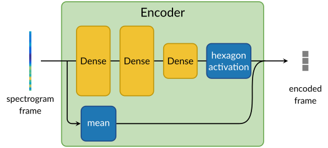
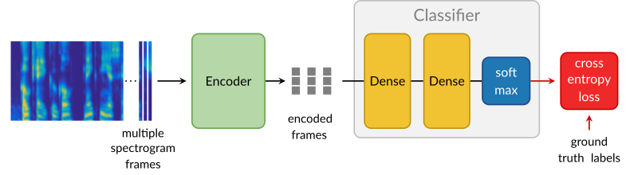
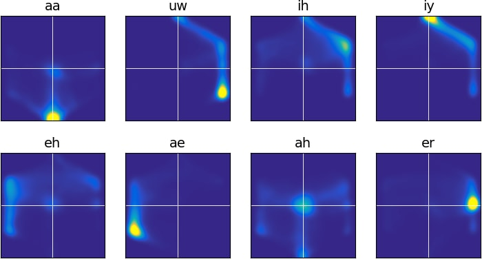

[Audio-to-Tactile Representation](../README.md) > [Tactile
Processor](tactile_processor.md)

# Phone Embedding

## Overview

We developed a low-latency system that maps input audio into a 2D vowel space.
Different pure vowels,
[monophthongs](https://en.wikipedia.org/wiki/Monophthong), map to distinct
points in this space. More generally, the same architecture could be used to map
vowels and consonants into a phone embedding space. This embedding is used to
spatially modulate the vowel channel energy envelope on the tactile interface,
rendered on a hexagonally arranged cluster of 7 tactors like a small 2D display.
The wearer can then identify the vowel by localizing the stimulus.

While we train the embedding on monophthong vowels alone, we apply the embedding
at inference time on all audio, including non-vowel and non-speech audio. This
way the system is not limited to audio, allowing the embedding to respond
however it does. We intentionally use a small network so that behavior outside
the training set is simple. Typically, a non-vowel input results in a moving
trajectory in the embedding. Our hope is that some non-vowel inputs are mapped
stably enough that a wearer could learn to recognize these trajectories, and we
do indeed see in preliminary studies that users can distinguish between some
consonants with this system.

## System



We use the CARL+PCEN frontend to analyze the input audio to bandpass energies to
form the input for a small network. The output of the network is a 2D vowel
coordinate. We spatially modulate the vowel channel energy envelope at this
coordinate on the cluster of 7 tactors. The spatial modulation is done
continuously with respect to the coordinate by weighting piecewise linearly over
the tactors. We do "subtactor rendering" instead of snapping to the closest
tactor.

## Embedding network

[Monophthong vowels](https://en.wikipedia.org/wiki/Monophthong) are often
represented as points in a 2D vowel space with articulatory "front-back" and
"open-close" dimensions as in this table:

~~~
        Front   Central   Back        Code   Example    Code   Example
      +-------+---------+------+      aa     bott       ih     bit
Close |  iy   |   ih    |  uw  |      ae     bat        iy     beet
      +-------+---------+------+      ah     but        uh     book
Mid   | eh,er |  ah,uh  |      |      eh     bet        uw     boot
      +-------+---------+------+      er     bird
Open  |  ae   |         |  aa  |
      +-------+---------+------+
~~~

Codes aa, iy, etc. are [ARPAbet phonetic
codes](https://en.wikipedia.org/wiki/ARPABET). Diphthongs are represented as
sounds that move between two points in this space.

## Inference

At inference time, the embedding network is 3 fully-connected layers. The last
layer is a bottleneck with 2 units to embed the frame as a 2D coordinate.


To constrain the embedded 2D coordinate to the hexagon, we apply a special
"hexagon activation", computed as

~~~
r = HexagonNorm(x, y)
x *= tanh(r) / r
y *= tanh(r) / r
~~~

and `HexagonNorm(x, y)` is a hexagonally-warped version of the Euclidean norm:


The effect is the activation maps any 2D coordinate inside the hexagon.

## Training

We use an encoder-decoder structure to train the embedding. The decoder tries to
classify the phone from the encoding. The decoder simulates the human wearing of
the audio-to-tactile interface, who tries to understand speech from the tactile
signals. The decoder's degree of success gives a sense of how easily a human
might understand the embedding.

During training, we concatenate the mean of the frame as a third dimension to
the embedding. This extra dimension is meant as a proxy for the information in
the energy envelope.



To give the decoder temporal context, we run 3 consecutive frames through the
encoder, concatenate them, and feed the resulting 9D vector as input to the
decoder. The decoder output is a vector of softmax classification scores for the
8 monophthong vowel classes aa, uw, ih, iy, eh, ae, ah, er.



We use regularizing penalties on the layer weights and to encourage the
embedding to map particular classes to particular target points. We use TIMIT
for training data.

To assess how well the trained net works, here are 2D histograms of how each
vowel is mapped.



The distributions are for the most part concentrated around the training
targets, approximating the above hexagon diagram.

We imagine this embedding approach could be extended for consonants, perhaps by
predicting articulatory dimensions such as manner and place, or by learning an
embedding over a training set including consonant examples.


## Using the code

Code for the phone embedding network is under `phonetics`.
Training is done in Python using the [JAX](https://github.com/google/jax) and
[DeepMind Haiku](https://github.com/deepmind/dm-haiku) libraries. Install Python
dependencies with

```{.sh}
sudo apt-get install python3-dev python3-pip python3-pandas
pip3 install jax dm-haiku absl-py matplotlib scipy sklearn
```

*Detail note:* most of the programs below have a bunch of optional arguments,
defined using the [absl flags](https://abseil.io/docs/python/guides/flags)
library. You can run the program with `--help` to print a list of flags, or look
for the flags in the source at the top of the file. For instance in
`make_training_data.py`,

```{.py}
flags.DEFINE_integer('num_worker_threads', 6,
                     'Number of parallel threads.')
```

defines flag `--num_worker_threads` accepting an integer value, with default
value 6 if not specified. In the commands below, I will just demonstrate the
main flags.


### Inference

I'll explain how to run inference first, since that is quicker to get running.
First, build the Python `run_phone_model_on_wav` inference program [with bazel,
even Python targets have to "build" before running]:

```{.sh}
bazel build -c opt phonetics:run_phone_model_on_wav
```

Then run the program on a WAV file, e.g. `testdata/phone_ae.wav`,
like this

```{.sh}
bazel-bin/phonetics/run_phone_model_on_wav \
  --input testdata/phone_ae.wav
```

This runs the C inference implementation
`phonetics/embed_vowel.c` on the WAV file, and shows a
figure window with a spectrogram-like plot and a plot of scores vs. time. For
instance the "ae" score should usually be the highest on `phone_ae.wav`.

The source code `phonetics/run_phone_model_on_wav.py` is
pretty short. This is a good starting point if you want to run the vowel
network, for instance to experiment with different ways of mapping its output to
tactile.

Besides the C inference implementation, this program can also run inference with
a trained model by pointing the `--model` flag to a .pkl file. I'll explain that
later after we go over training.


### Training

Now let's train the phone embedding model. This is interesting for instance to
change which set of phones the network tries to distinguish, or experimenting
with the network structure to try to make it work better. Here are the steps to
training the network.

1. We use the [TIMIT
   dataset](http://www.ldc.upenn.edu/Catalog/CatalogEntry.jsp?catalogId=LDC93S1)
   for training. So first, you will need to obtain a copy of TIMIT.

2. TIMIT stores its audio in an esoteric format ["NIST SPHERE"], so the next
   step is to convert everything to WAV to make it usable. Do this with the
   `ingest_timit` program:

   ```{.sh}
   bazel build -c opt phonetics:ingest_timit
   bazel-bin/phonetics/ingest_timit \
    --input_dir path/to/raw_timit --output_dir path/to/cooked_timit
   ```

   replacing "`path/to/raw_timit`" with wherever you have unpacked TIMIT, and
   "`path/to/cooked_timit`" is an output directory for the converted files.

3. Before training, we prepare training data. This makes training faster if you
   make several training runs, since it eliminates some otherwise repeated work.
   Do this with two runs of the `make_training_data` program, once to make a
   training set and again to make a testing set:

    ```{.sh}
    bazel build -c opt phonetics:make_training_data
    # Prepare training data.
    bazel-bin/phonetics/make_training_data \
      --examples path/to/cooked_timit/train/'*.wav' --output train.npz
    # Prepare testing data.
    bazel-bin/phonetics/make_training_data \
      --examples path/to/cooked_timit/test/'*.wav' --output test.npz
   ```

   The program will write the data to `train.npz` and `test.npz`.

4. Run training itself. Do this by running the `phone_model` program:

    ```{.sh}
    bazel build -c opt phonetics:phone_model
    bazel-bin/phonetics/phone_model \
      --output trained_models/$(date +%Y%m%d_%H%M%S) \
      --train_npz train.npz --test_npz test.npz \
      --epochs=20
    ```

    This trains the model, using 20 epochs over `train.npz`. The `--output` flag
    sets the output directory. The command above sets the output to a
    datestamped location like `trained_models/20200723_071411`. The trained
    model is saved there as `model.pkl`. After training, the program runs
    evaluation, over `test.npz`, and writes an HTML report with histogram plots,
    confusion matrix, etc. to the output directory.

    Some fine-tuning flags: you can set which classes the network tries to
    distinguish with `--classes`, e.g. `--classes=sil,aa,ae,uw` for sil
    (silence), aa, ae, and uw. The classes come from TIMIT's labeling and are
    [ARPABET codes](https://en.wikipedia.org/wiki/ARPABET). See the comment at
    the top of `phone_model.py` for a list of all available classes.

5. After training, use `run_phone_model_on_wav` to run inference with the
   trained model like this:

    ```{.sh}
    bazel build -c opt phonetics:run_phone_model_on_wav
    bazel-bin/phonetics/run_phone_model_on_wav \
      --model trained_models/20200723_071411/model.pkl \
      --input path/to/wav
    ```

    replacing `trained_models/20200723_071411` with the location of the model.

6. Note that `tactile_worker`, `run_tactile_processor`, and other C code use the
   C inference implementation in `embed_vowel.c`. This C library implements the
   network and hardcodes the parameters, without depending on JAX [for sake of
   better performance and light dependencies]. If you want these codes to use a
   different trained model, some manual work is needed to port it to C.

    First, export the trained model parameters with `export_model_as_c_data`:

    ```{.sh}
    bazel build -c opt phonetics:export_model_as_c_data
    bazel-bin/phonetics/export_model_as_c_data \
      --model trained_models/20200723_071411/model.pkl \
      --output params.h
    ```

    This writes the parameters as a few C arrays. It does not auto convert the
    model behavior to C; it just dumps the parameters. Next is the manual work.
    Replace `embed_vowel_params.h` with the dumped parameters. In
    `embed_vowel.c`, update `kEmbedVowelTargets` [if the classes are different]
    and update the function `EmbedVowelScores()` [if the network structure is
    different]. Finally, try running the new C inference implementation on a WAV
    file with

    ```{.sh}
    # Run C inference implementation.
    bazel build -c opt phonetics:run_phone_model_on_wav
    bazel-bin/phonetics/run_phone_model_on_wav \
      --input path/to/wav
    ```

    and compare the result to Python JAX/Haiku inference implementation,

    ```{.sh}
    # Run Python inference implementation.
    bazel-bin/phonetics/run_phone_model_on_wav \
      --model trained_models/20200723_071411/model.pkl \
      --input path/to/wav
    ```

 The model itself is defined in `phonetics/phone_model.py`
 in `model_fun()` as a Haiku model, and its loss and optimizer are in `train()`.
 This is the key place to experiment with changes to the network.
