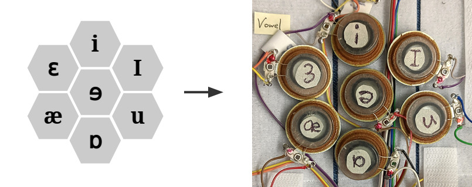

[Audio-to-Tactile Representation](../README.md)

# Tactile Processor

This page describes our approach to audio-to-tactile processing, and
`run_tactile_processor`, a demo program that implements it.

## Hardware

The demo program is intended to be used with a tactile sleeve of 10 or more
tactors. As described on the main page, the tactors are [Tectonic TEAX13C02-8/RH
speakers](https://www.parts-express.com/tectonic-teax13c02-8-rh-13mm-exciter-8-ohms--297-214)
with Velcro on the back so that they can be repositioned. We arrange the tactors
on the sleeve like this:


A hexagonal cluster of 7 tactors is for representing vowel sounds, and two
additional tactors for fricative and baseband (lower frequency) energy. The idea
is that this interface is used on the forearm with the fricative tactor near the
wrist and the baseband tactor near the elbow.

Note, as done in the photo above, we found it effective to place the baseband
tactor with a fair amount of space from vowel cluster. This helps mitigate
masking effects. The three unlabeled tactors at the top of the photo are unused.


## Building the `run_tactile_processor` demo program

The demo is implemented in C and depends on the [SDL2](https://www.libsdl.org) and
[PortAudio](http://www.portaudio.com/) libraries. On Debian-based systems, use

``` shell
sudo apt-get install libsdl2-dev portaudio19-dev
```

to install development headers for these libraries. Then build
`run_tactile_processor` with

``` shell
cd audio-to-tactile
make run_tactile_processor
```

This should produce a `run_tactile_processor` executable file.

## Running `run_tactile_processor`

The `run_tactile_processor` program runs audio-to-tactile processing on
microphone or WAV input, producing a visualization and 10-channel tactile signal
output. Click the image below to open a web demo of this visualization.

[](https://google.github.io/audio-to-tactile/demo/tactile_processor.html)

The 10 output channels (with base-1 indexing) are

    1: baseband  6: eh                        (7)-(6)   sh fricative
    2: aa        7: ae                        /     \      (9)
    3: uw        8: uh               (1)    (2) (8) (5)
    4: ih        9: sh fricative   baseband   \     /     (10)
    5: iy       10: fricative                 (3)-(4)   fricative
                                           vowel cluster

The intention is that these tactile channels are rendered on the TAPS sleeve
with tactors in the above arrangement. Tactile output is sent as audio
output using PortAudio to the device set by `--output`.

Use `--channels` to map tactile signals to output channels. For instance,
`--channels=3,1,2,2` plays signal 3 on channel 1, signal 1 on channel 2, and
signal 2 on channels 3 and 4. A "0" in the channels list means that channel is
filled with zeros, e.g. `--channels=1,0,2` sets channel 2 to zeros. The included
[`play_buzz` program](play_buzz.md) might be useful to determine the mapping
between channels and tactors.

When running the program, at least `--input`, `--output`, and `--channels` must
be specified. The full list of options is below:

 * `--input=<int>` - Sets the PortAudio input device number (a microphone). If
   not specified, tactophone prints a numbered list of connected devices.

 * `--input=<wavfile>` - Alternatively, input can be read from a WAV file. In
   this case, the WAV file determines the sample rate.

 * `--output=<int>` - Sets the PortAudio output device number to play tactile
   signals to. If not specified, tactophone prints a numbered list of connected
   devices.

 * `--sample_rate_hz=<int>` - Sample rate. Note that most devices only support a
   few standard audio sample rates, e.g. 44100 Hz.

 * `--channels=<list>` - Specifies the channel order. More details on this are
   above. The list should be a comma-delimited sequence of integers between 0
   and 10.

 * `--channel_gains_db=<list>` - Sets the gain for each channel in decibels.

 * `--gain_db=<float>` - Overall output gain in dB.

 * `--block_size=<int>` - TactileProcessor `block_size`. Must be a power of 2.

 * `--chunk_size=<int>` - Frames per PortAudio buffer. (Default 256).

 * `--cutoff_hz=<float>` - Cutoff in Hz for energy smoothing filters.

 * `--fullscreen` - Fullscreen display.


## Algorithm

Our processing has two aspects that we believe are valuable in conveying speech.
First, it extracts energy envelopes over four frequency bands, capturing
glottal pulses, vowel formants, and frication noise. Second, it discriminates
vowel sounds, mapping them to distinguishable tactile stimuli patterns.

### Energy envelopes

We compute four energy envelopes, for the glottal pulses, vowel formants,
and two bands for fricatives. Each envelope is computed from the input audio by

 * bandpass filtering,
 * rectifying,
 * smoothing
 * applying automatic gain control and/or nonlinear compression (optional).

The part that varies between the three envelopes is the passband frequency range
of the bandpass filter. These ranges for typical speech are roughly

 * 0-500 Hz for the glottal pulses
 * 500-3500 Hz for vowel formants
 * 2500-4000 Hz for postalveolar fricatives like "sh".
 * 4000-6000 Hz for other fricatives like "s".

### Vowel discrimination

In lip reading, it is often difficult to discriminate vowels, while consonants
have for the most part more visible lip movement. Monophthong vowels (like the
vowels in "beet", "bat", and "boot") are "pure" vowels, where articulation is
relatively fixed throughout the vowel sound. We interpret diphthong vowels (like
the vowels in "bate" and "buy") as trajectories that glide between two
monophthongs, so that it is enough to represent the monophthongs.

Pure vowels, monophthongs, are often represented as points in a [2-D vowel
space](https://sail.usc.edu/~lgoldste/General_Phonetics/Source_Filter/SFc.html),
like this table (in which aa, iy, etc. are [ARPAbet phonetic
codes](https://en.wikipedia.org/wiki/ARPABET)):

            Front   Central   Back        Code   Example    Code   Example
          +-------+---------+------+      aa     bott       ih     bit
    Close |  iy   |   ih    |  uw  |      ae     bat        iy     beet
          +-------+---------+------+      ah     but        uh     book
    Mid   | eh,er |  ah,uh  |      |      eh     bet        uw     boot
          +-------+---------+------+      er     bird
    Open  |  ae   |         |  aa  |
          +-------+---------+------+

In order to discriminate the monophthong vowels, it is helpful that they have a
simple signal structure. The signal is nearly a stationary process, so it is
well characterized by its spectral distribution. The shape of this distribution,
namely the location of the peaks or formants, allows us to reliably distinguish
the vowels.

We feed each PCEN-normalized frame into a small [phone embedding
network](phone_embedding.md), mapping the frame to a 2D coordinate in a vowel
space.

Specifically, at inference, we perform the following processing:

1. The input audio is transformed to a time-frequency representation using the
   Cascade of Asymmetric Resonators, Linear (CARL) filterbank.

2. This is followed by per-channel energy normalization (PCEN), as described in

> Yuxuan Wang, Pascal Getreuer, Thad Hughes, Richard F. Lyon, Rif A. Saurous,
> ["Trainable frontend for robust and far-field keyword
> spotting."](https://arxiv.org/pdf/1607.05666.pdf) 2017 IEEE International
> Conference on Acoustics, Speech and Signal Processing (ICASSP). IEEE, 2017.

3. Each frame of energies is the input to the neural network, producing a
   soft classification of the monophthong vowel.

In training, we use the TIMIT dataset for training data, which includes
accurately timestamped labels of when individual phonemes occur. To assess how
well the trained net works, here are 2-D histograms of how each vowel is
mapped. The red points mark the training targets.


The distributions are for the most part concentrated around the training
targets.

### CARL

CARL is an efficient linear filterbank of bandpass channels on an auditory
frequency scale, with spacing to the next channel proportional to the auditory
bandwidth at each channel. Channels are in decreasing frequency order.


The CARL filterbank is implemented as a cascade of biquad filter stages. The
resonant frequency decreases with each stage. The kth channel is formed by
taking the output after (k+1) stages, then applying a difference filter. For
efficiency, later stages of the cascade decimate the signal to successively
lower sample rates where possible.

### PCEN

After the CARL filterbank, we convert the bandpass outputs to energies by
half-wave rectification and squaring, then lowpass filter to obtain smooth
energy envelopes. The energy envelope for each channel is then compressed with
PCEN,


where `pcen denom` is a lowpassed version of envelope and by default α=0.7,
β=0.2, γ=10⁻¹², δ=0.001. PCEN can be seen as a feed-forward auto gain control,
implemented by the ratio, followed by a compressive pointwise nonlinearity.

For example, the plot below shows the result of processing the input audio "Ok
Google, make me a sandwich" through CARL + PCEN:


### Rendering onto the tactile interface

Finally, we render the signals onto the tactile interface. The glottal pulse
(aka baseband channel) and two fricative envelopes are each rendered directly on
a tactor.



The vowel formant envelope is rendered on a cluster of seven hexagonally
arranged tactors, which we consider as a (small) 2-D display. The hexagonal
arrangement reduces the number of tactors needed. The 2D vowel coordinate from
the phone embedding network is presented in this display. We use the
coordinate continuously, interpolating the weight for fine sub-tactor rendering.
Only 2 or 3 tactors are activate at a given moment.

For the 2 or 3 tactors that are active, we drive them with the processed
envelope signal from the vowel (500-3500 Hz) channel; this envelope signal is in
a band of about 10-500 Hz.


## Implementation

Summary of code organization:

 * `tactile_processor.{h,c}` - Main API, taking audio as input and product tactile output.
 * `carl_frontend.{h,c}`, `carl_frontend_design.{h,c}` - Implements CARL + PCEN frontend.
 * `embed_vowel.{h,c}` - Vowel network inference.
 * `hexagon_interpolation.{h,c}` - Interpolation of 2-D vowel coord onto hexagon cluster.
 * `tactor_3_channel.{h,c}` - Energy envelope extraction.
 * `butterworth.{h,c}` - Butterworth filter design.
 * `complex.{h,c}` - Complex arithmetic.
 * `fast_fun.{h,c}`, `fast_fun_compute_tables.{h,c}` - Fast log2, 2^x, pow.
 * `read_wav_file.{h,c}`, `write_wav_file.{h,c}` - WAV file I/O.
 * `util.{h,c}` - Miscellaneous utilities for tactile processing.
 * `logging.h` - `CHECK` and `CHECK_NOTNULL` macros.


