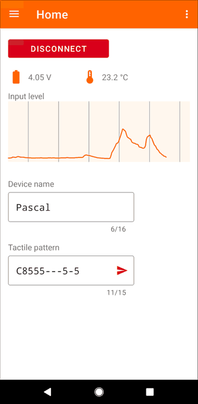
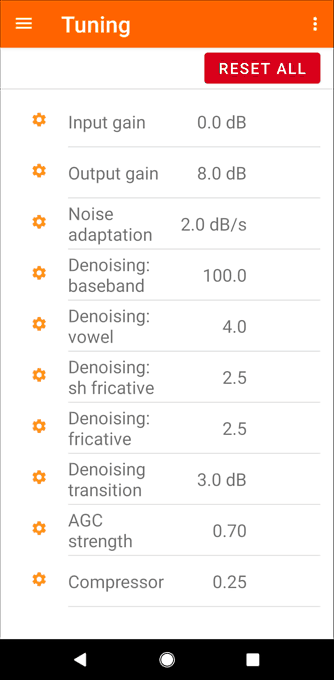

# Android application

The Audio-to-Tactile Android app connects to tactile devices over BLE. You can
use the app to check the device microphone, battery level, configure algorithm
tuning knobs, and so on.


## Building

1. Install and open [Android Studio](https://developer.android.com/studio).

2. In the project selection screen, click Open and select the `extras/android`
   folder.

3. Select the release build under *Build Variants*.

4. Run *Build → Make Project*. The resulting APK will be under
   `extras/android/app/build/outputs/apk/release/`.

## App installation

The app requires an Android phone with Oreo 8.0.0 or later (API level 26).

**First-time development prerequisites:**
Enable "developer mode" on your Android phone: go to *Settings → About phone*
and tap Build number seven times. Return to the previous screen to find
Developer options at the bottom (see [Configure on-device developer
options](https://developer.android.com/studio/debug/dev-options)).

On your computer, install the
[`adb` Android Debug Bridge
utility](https://developer.android.com/studio/command-line/adb).
Use a USB cable to connect your Android phone to your computer. Then install the
APK on the phone with the ADB shell command

```{.sh}
adb install AudioToTactile.apk
```
replacing "`AudioToTactile.apk`" with the path of APK to be installed.

If successful, `adb` will print "Performing Streamed Install, Success". On
the phone, the installed "Audio-to-Tactile" app icon looks like this:


## Using the app

### Connecting

With the tactile device turned on, open the Audio-to-Tactile app and press
the "Connect" button. The app will show a list of found tactile devices.
Note: For power efficiency, the tactile device does BLE advertising for only
the first 5 minutes after it turns on. So if the connection screen doesn't
show up, try turning the device off and on again, wait 5 seconds, then press
"Connect" again.

### Home screen

Once connected, the app shows a home screen. This displays the current
battery voltage, temperature, the device name, and a scrolling input level
graph from the device microphone. The scrolling graph is useful to check
that the device is getting input at a reasonable gain. Note that the plot has
about a 1 second delay.



### Other screens

Use the hamburger ☰ button in the upper-left corner to open the navigation
drawer. You can reach all the tools in the app from here:



* **Tuning**: Adjust algorithm tuning knobs in real time.
* **Channel map**: Change the gain individually for each tactor and configure
  which source plays on which tactor.
* **Pattern editor**: Design and play tactile patterns on the device.
* **Firmware**: Send a firmware update to the device over BLE.
* **Log**: Diagnostic log messages.
