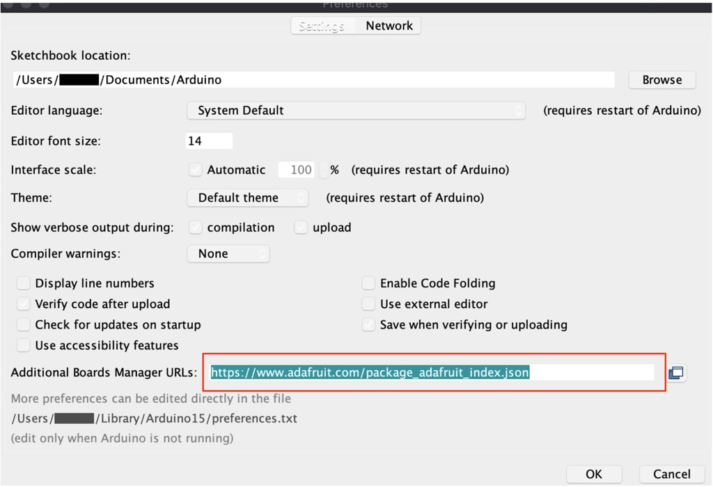
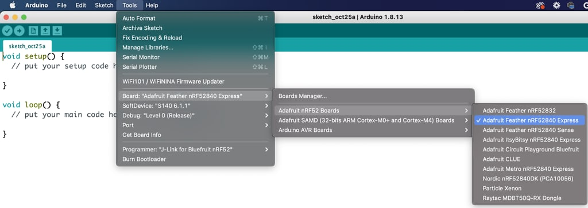

# Firmware

The firmware runs on the microcontroller. The firmware was written as a C/C++
Arduino-compatible library. However, in our code, we mostly use custom
drivers, such as for PWM ([pulse-width
modulation](https://en.wikipedia.org/wiki/Pulse-width_modulation)) and ADC
([analog-to-digital
converter](https://en.wikipedia.org/wiki/Analog-to-digital_converter)),
instead of using Arduino's `analogWrite()` and `analogRead()`. We use the
Adafruit Feather nRF52840 board definition. Below are three ways to
program/compile firmware.


## How to flash device firmware given an ino.zip

Given an ino.zip file, you can update the device firmware over a USB
connection using the
[flash_firmware.py script](../tools/flash_firmware/index.md).


## Programming and with USB

This is a standard and convenient way to program an Arduino board and can be
done from the Arduino IDE. This way the source code can be modified and
compiled. The installation steps:

1.  Download the latest [Arduino IDE](https://www.arduino.cc/en/software)

2.  Go to Arduino Preferences. Add
    https://www.adafruit.com/package_adafruit_index.json to Additional Board
    Manager URLs. For additional details see
    [Adafruit installation guide](https://learn.adafruit.com/introducing-the-adafruit-nrf52840-feather/arduino-bsp-setup).

    

3.  Go to *Tools &rarr; Boards &rarr; Boards Manager...* Type *feather* in the
    search bar. Install the latest version of Adafruit nRF52 boards.

    

4.  Select the Adafruit Feather nRF52840 board.

    

5.  Install the audio-to-tactile library by copying into it Arduino Libraries
    folder:

    Mac OSx: `Documents/Arduino/libraries`

    Linux: `~/Arduino/libraries`

6.  Restart the Arduino IDE.

7.  Select the correct USB-serial port by going to *Tools &rarr; Ports.* You
    should see something like "`/dev/cu.usbmodem14301`" on Mac OSx. On
    Windows it will be COM#.

8.  Connect the device with USB to the computer. Compile and upload the code by
    clicking the upload button in the Arduino IDE.

## Flashing bootloader with J-link

If you are building the board from scratch or the bootloader is bricked, the
bootloader needs to be flashed. The bootloader can easily get bricked during
development if buggy code is uploaded. You will need a J-link programmer such as
[Segger EDU mini](https://www.segger.com/products/debug-probes/j-link/models/j-link-edu-mini/)
and a
[pogo-pin adapter](https://www.digikey.com/en/products/detail/TC2030-CTX/TC2030-CTX-ND/5023324)
by TagConnect.

1.  Connect J-link to the board. Note that the J-link doesn't provide power. The
    programmer could be held by hand while programming or secured using a
    [retainer clip](https://www.digikey.com/en/products/detail/TC2030-CLIP/TC2030-CLIP-ND/2605371)
    [attaching programmer](programming_pogo_pins.jpg)

2.  Select the Adafruit Feather nRF52840 board
    (*Tools &rarr; Board &rarr; ...*).

3.  Burn bootloader: *Tools &rarr; Burn Bootloader.*

4.  If successful, USB-serial port should show up in *Tools &rarr; Port*

## Programming with BLE Over-The-Air (OTA)

The microcontroller can be programmed wirelessly over Bluetooth. This requires
the Android application. I would not recommend this option during code
development, as it requires more steps and time to get the code into the board.

1.  Generate the firmware file. This can be done using Arduino IDE. Enable
    verbose output by going to *Arduino &rarr; Preferences &rarr; Check “Show
    Verbose Output”* during compilation and upload.

2.  Compile and run the code in Arduino (make sure verbose output is enabled).
    You should see something like this in terminal output, with the
    `/var/folders..` is the path to the zip file, that can be used in OTA
    updates:

    ```sh
    /Users/$USER/Library/Arduino15/packages/adafruit/hardware/nrf52/0.24.0/tools/adafruit-nrfutil/macos/adafruit-nrfutil
    --verbose dfu serial -pkg
    /var/folders/wt/byc7v8fx4wn5vh54frzbd4gc00kcvr/T/arduino_build_196049/blinky_ota.ino.zip
    -p /dev/cu.usbmodem141401 -b 115200 --singlebank
    ```

3.  I usually copy the path into the Chrome address bar, and that automatically
    starts the download of the zip file.

4.  Copy that file to the phone. There are various ways to do it: using ADB
    debugger, connected over USB to a computer, or copying to Google Drive.

5.  Open the Firmware tab in the dropdown menu in the Android app. Click on
    update and select the zip file. The default settings should work.
