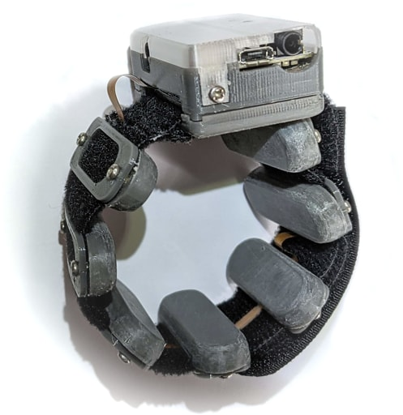
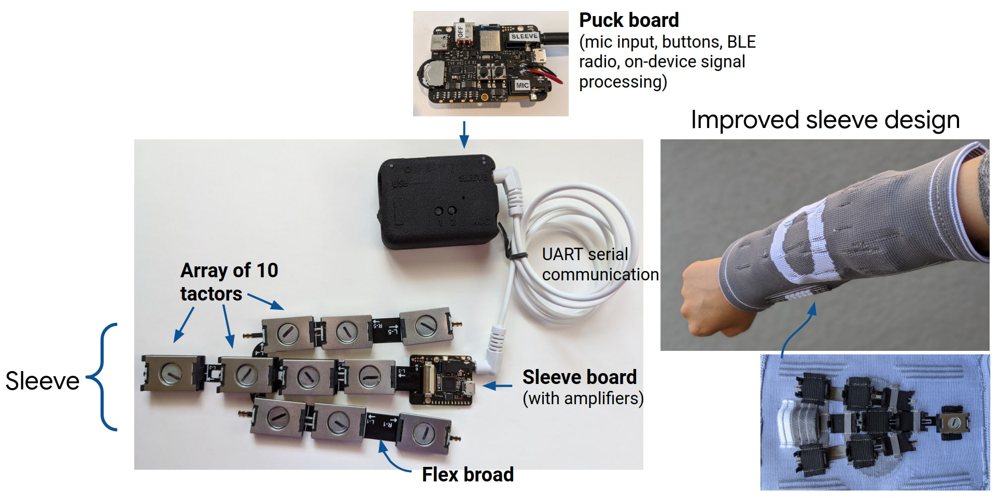
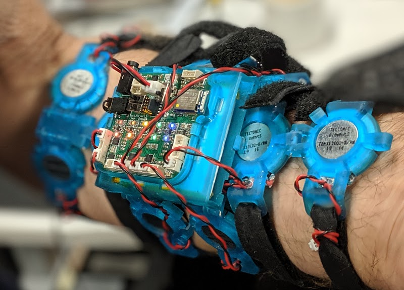
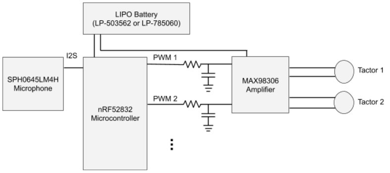
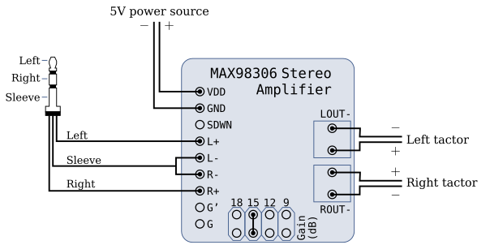
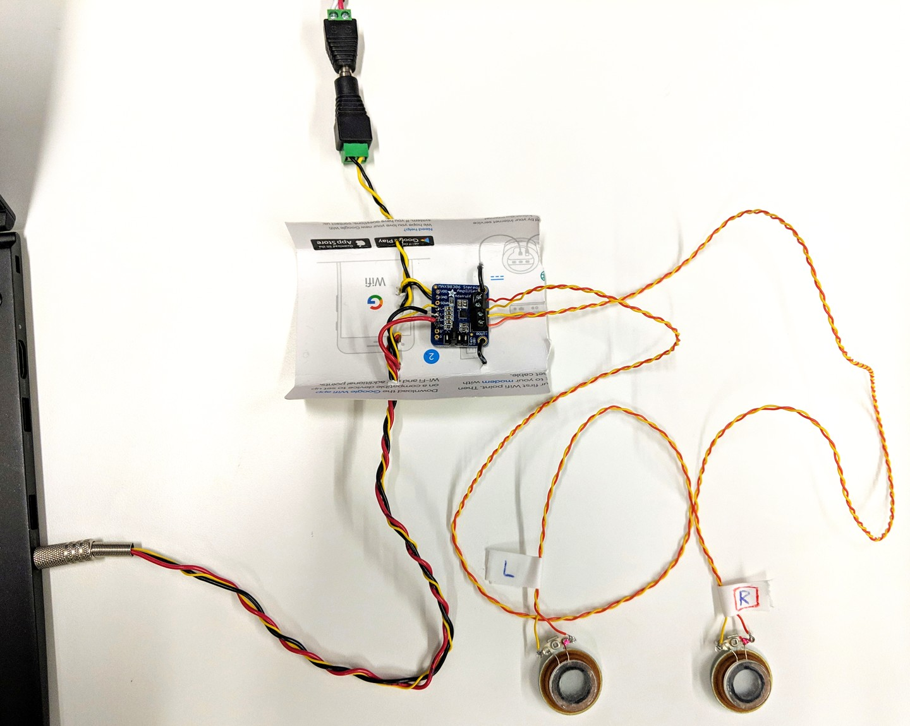

# Hardware

A key part to researching tactile interfaces is the hardware. This section
describes what we have built. This list is in reverse chronological order.

## Wearable form factors

### Slim bracelet (v0.5)

This is the latest electronics board revision. Similar to v0.4 but with few
electronic bugs fixes. This design is still in manufacturing and testing.

### Slim bracelet (v0.4)

This design has been demonstrated and discussed in the
[UIST publication](https://dl.acm.org/doi/10.1145/3472749.3474772), as
Vibrotactile Haptics Platform (VHP).

This is wearable watch-band like device with 8 tactors. Compared to our earlier
"sleeve" form factors, the idea here is that a band is more convenient to put on
and wear.

The pdf of the schematic can be found
[here](slim_bracelet_design/pcb/slim_schematic_v1.pdf). The design was done in
Altium Designer. The design files are located in
[/slim_bracelet_design/pcb](extras/doc/hardware/slim_bracelet_design/pcb).

Use the firmware programming [guide](../firmware/index.md) to see different
options for programming the embedded microcontroller. The programming is
simplified by using Arduino IDE.

The mechanical design was done using Fusion 360, and parts were printed on Prusa
i3 MK3S+. The mechanical design files for the bracelet can be found in
[/slim_bracelet_desing/mechanical](extras/doc/hardware/slim_bracelet_design/mechanical)

The steps to put the bracelet together are described
[in this guide](../mechanical/index.md).

### Sleeve (v0.3)

Wearable sleeve-like device with 10 tactors. In this design, the electronics are
split into separate "puck" and "sleeve" modules, connected by a cable. The puck
contains the mic and battery, and the sleeve has the tactor array worn on the
forearm. For fit, the tactors are mounted on a flexible 3D-printed mesh and
wired using a flex PCB.

### Sleeve (v0.1 and v0.2)

Wearable sleeve-like device with 10 tactors. It has a microphone, an nRF52
microcontroller for light signal processing, and an array of 10 tactors. The
device has a custom PCB, capable of driving up to 12 tactors. To improve the
fit, the device body is articulated with hinge joints to conform to the geometry
of the wearer's arm.

Circuit diagram (the right half from PWM output onward is repeated six times
for up to 12 tactors):

## Lab hardware

### 24-tactor sleeve

As an early non-mobile prototype, we connected a sleeve of 24 tactors to a Motu
audio interface. We also used this hardware to test the TAPS phonemic code system.

The sleeve body is constructed from cloth and Velcro. The tactors are
[Tectonic TEAX13C02-8/RH
speakers](https://www.parts-express.com/tectonic-teax13c02-8-rh-13mm-exciter-8-ohms--297-214)
with [vinyl
bumpers](https://www.amazon.com/Shepherd-Hardware-9965-SurfaceGard-Self-Adhesive/dp/B0007GFC46)
glued to them. It is connected by two ribbon cables to a [Motu
24Ao](http://motu.com/products/avb/24ai-24ao) audio interface device, which
connects by USB to a computer producing tactile signals. The Motu has three
DB25 D-Sub connectors, each with eight channels. We use twelve [MAX98306
Stereo Amplifier](https://www.adafruit.com/product/987) boards for
amplification.

### Stereo amplifier circuit

A simple stereo amplifier circuit with a [MAX98306 Stereo
Amplifier](https://www.adafruit.com/product/987) board and a [3.5mm stereo
plug](https://www.adafruit.com/product/1800) makes it possible to drive two
tactors with the audio output from a computer. This is useful for small
experiments.

As above, the tactors are [Tectonic TEAX13C02-8/RH
speakers](https://www.parts-express.com/tectonic-teax13c02-8-rh-13mm-exciter-8-ohms--297-214)
with [vinyl
bumpers](https://www.amazon.com/Shepherd-Hardware-9965-SurfaceGard-Self-Adhesive/dp/B0007GFC46)
glued to them.

