# How to assemble the bracelet

This section describes how the slim bracelet is put together.

### Making the enclosure parts

There are two ways to make the parts for the bracelet.

First, using a home 3d printer. I used Prusa i3 MK3S printer with pretty good
results. I printed the parts with PETG (Polyethylene terephthalate glycol). The
disadvantage of this method is that it requires postprocessing: sanding and
removal of support material.

Second, ordering the parts online with a Selective Laser Sintering (SLS)
printer. The parts can be conveniently ordered on Shapeways or from other
companies. It provides a much better result as it did not need any
postprocessing.

The zip of for the parts can be downloaded
[here](../hardware/slim_bracelet_design/enclosure_parts/bracelet_design_files.zip).

### Adding the brass inserts

The next step is to add the brass inserts to the parts. The brass inserts hold
the screws in place. Screwing could have been done without them, but they allow
a reusable and robust screw interface. This requires the following things:

1.  Soldering iron. I used the common
    [Hakko FX888D-23BY](https://www.amazon.com/Hakko-FX888D-23BY-Digital-Soldering-Station/dp/B00ANZRT4M)
    with a
    [special tip](https://www.amazon.com/Heat-Set-Inserts-Compatible-SP40NKUS-Connecting/dp/B08B17VQLD/)
    for heat inserts.

2.  M2 x 3mm brass inserts. I got them on
    [Amazon](https://www.amazon.com/a16041800ux0766-Cylinder-Injection-Molding-Embedded/dp/B01IZ157KS).

I heated up the soldering iron to 650 degrees Celsius. Then, I pushed the brass
insert with the soldering iron tip into the holes.

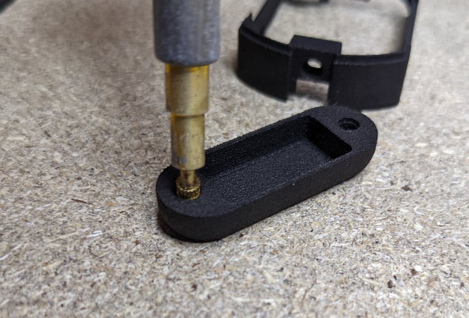

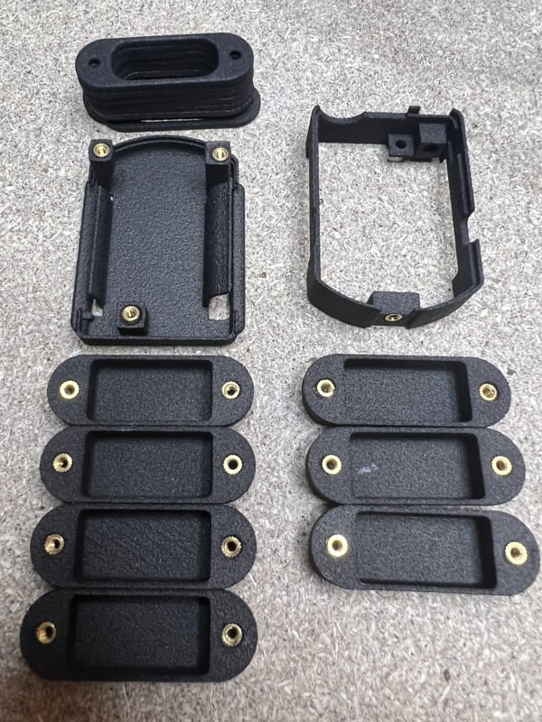

### Making the strap

I used a 1x12 inch velcro strap from

[Amazon](https://www.amazon.com/gp/product/B01MU56DCQ/).

First, cut off the buckle with scissors.
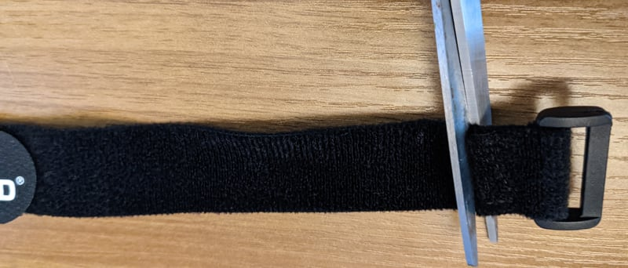

Place the strap end with the cut off buckle into the small hoop in the
3d-printed case. Make sure that the text (ENVISIONED) on the velcro end is
facing the top.

Put a line of hot glue on the end of the strap. Pinch the strap end down to glue
the two pieces of strap. This should be done right after applying the glue,
before it gets cold. 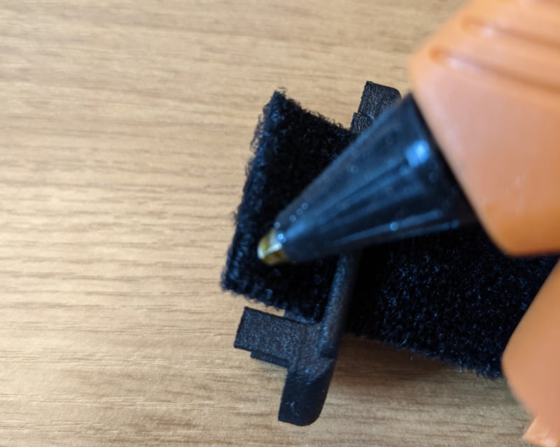

Once glue cools down, cut a hole in the strap with utility knife.

The next step is to place the end of the flex PCB with the connector into the
cut hole in the buckle. 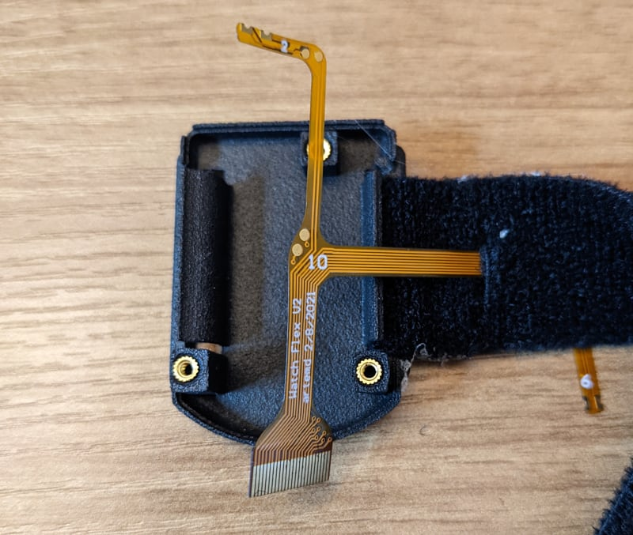

### Attach the actuators

Solder the individual
[linear resonant actuators (LRAs)](https://www.digikey.com/en/products/detail/jinlong-machinery-electronics-inc/LV101040A/12323590)
to the flex PCB. 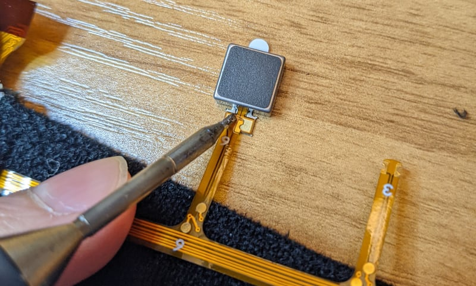

Add the pill-shaped actuator enclosures. The actuators come with the sticky
back, which is exposed after removing the white cover paper.
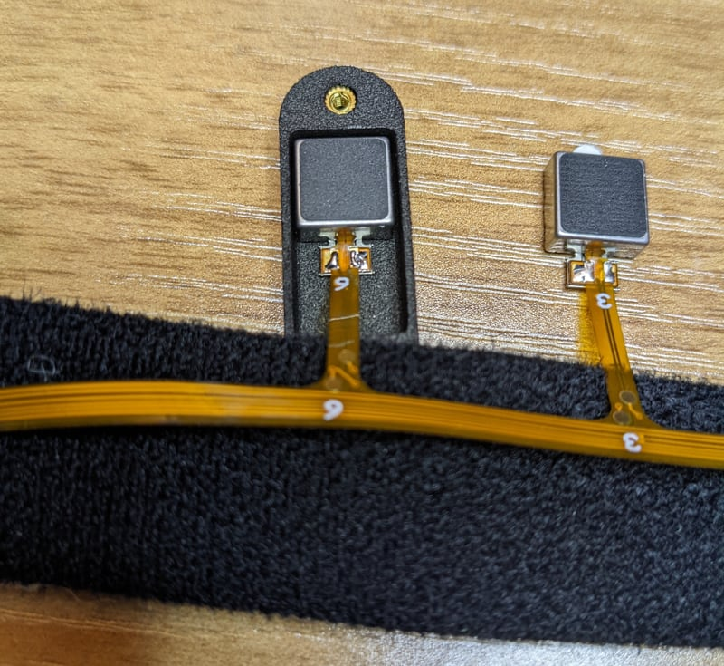

After soldering and adding enclosures, flip the bracelet.
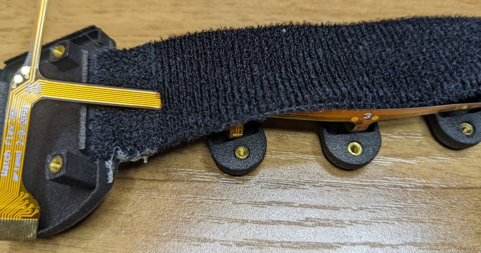

Screw on the actuator top. I used the
[M2 5mm hex](https://www.amazon.com/gp/product/B01MZ60SJJ/) screws.
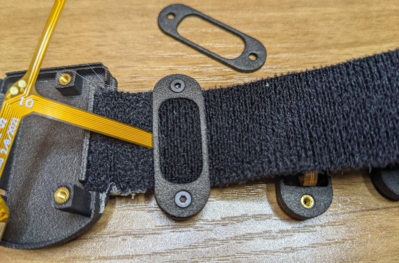

The spacing between the actuators should be 0.25 inch.
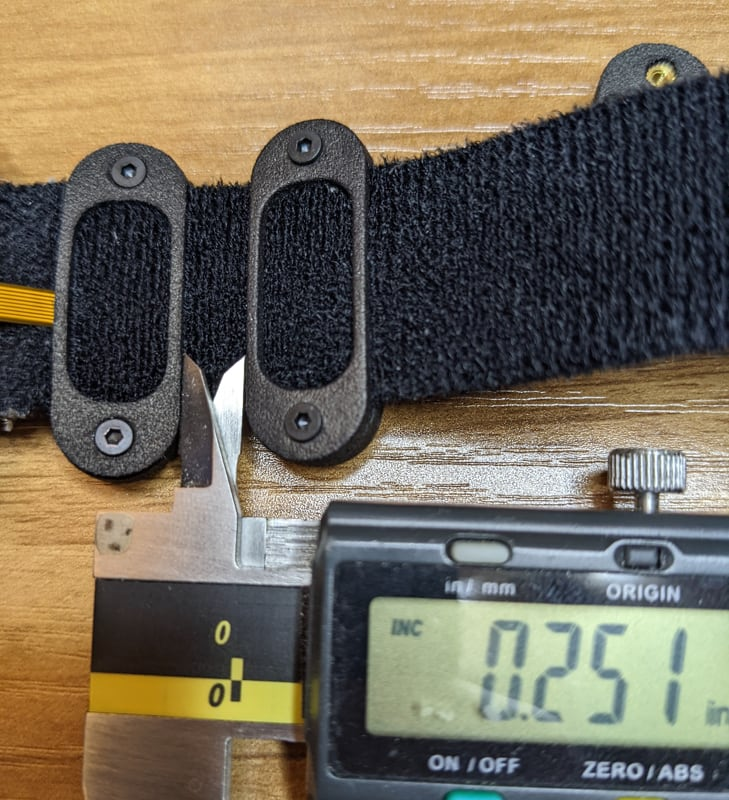

Repeat for all 7 actuators. The finished actuators should look like this.
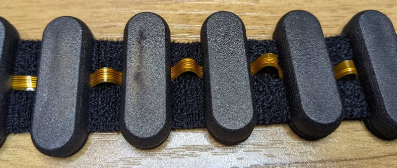

### Assembling the main enclosure

Add the top cover to the enclosure. The cover is screwed with
[M2x5mm phillips screw](https://www.amazon.com/Yootop-Stainless-Phillips-Machine-Fastener/dp/B07HD3R67K).
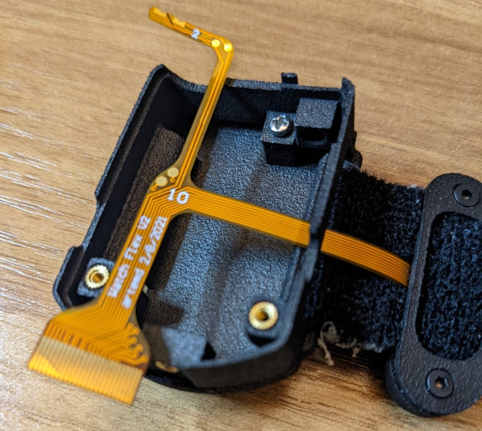

Add the battery by pushing it into the enclosure. We used
[100 mAh LiPo](https://www.digikey.com/en/products/detail/tinycircuits/ASR00035/9808767).
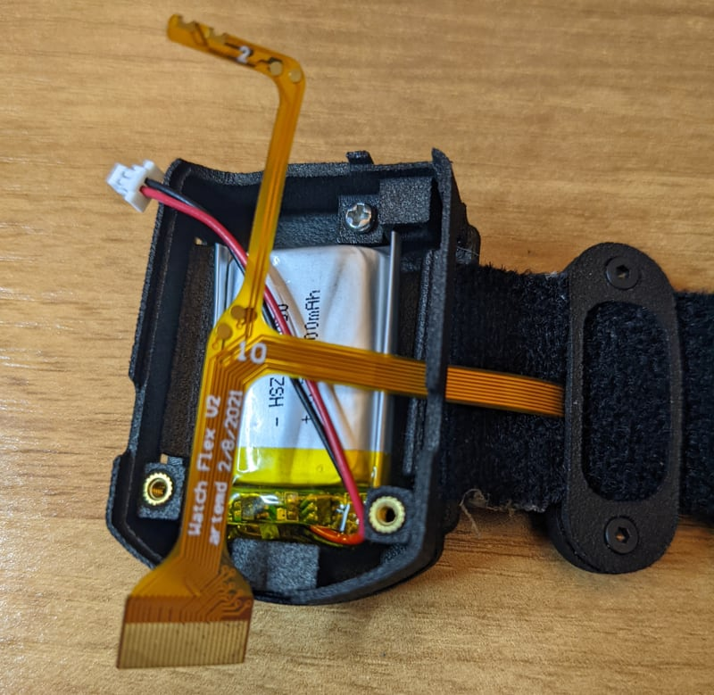

Solder and glue the enclosure LRA. We used additional
[tape](https://www.digikey.com/en/products/detail/3m-tc/1-2-5-4926/2649388) to
attach it, since the original one is not strong enough to hold LRA in place.
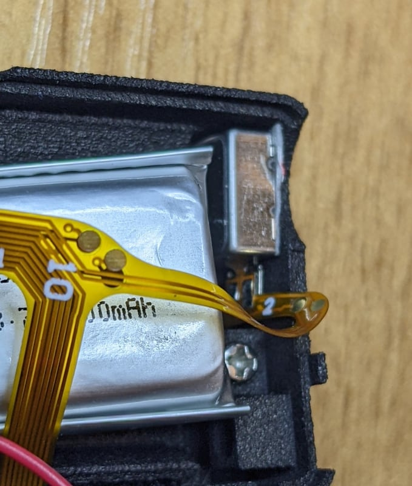

Connect the flex PCB connector and battery connector to the main PCB.
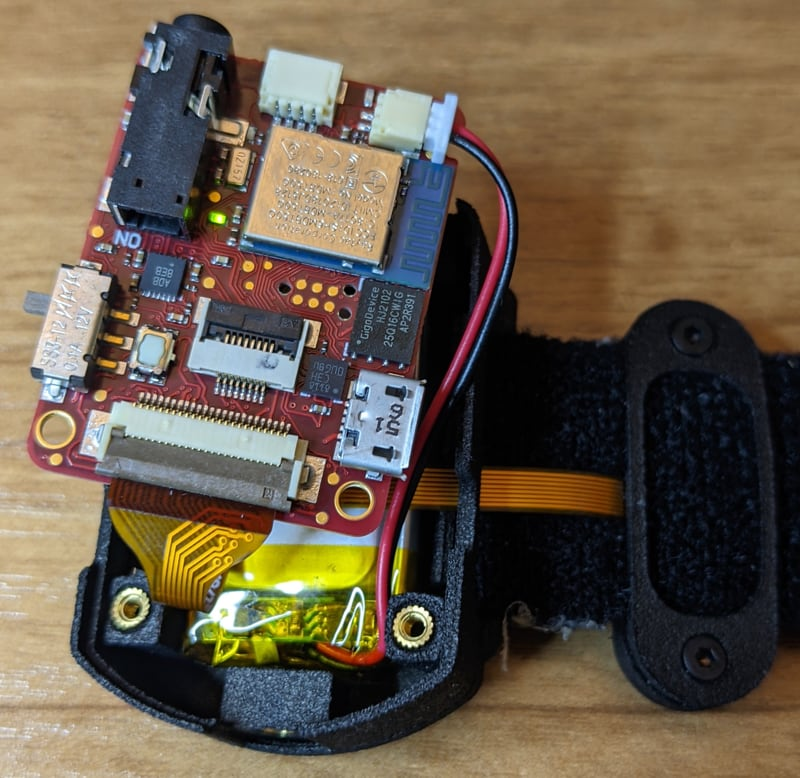

Screw the board with two screws using M2 5mm Phillips screws. Add a
[rubber washer](https://www.amazon.com/gp/product/B08F2CT93M) between the screw
and the PCB. 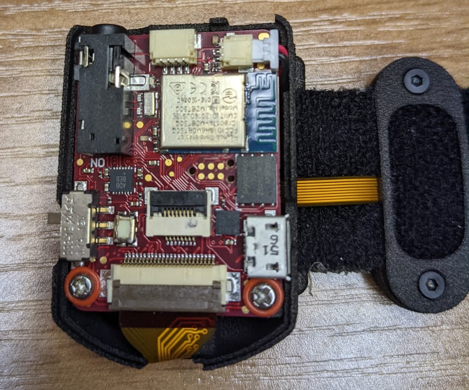

Attach the lid with two M2 5mm Phillips screws.
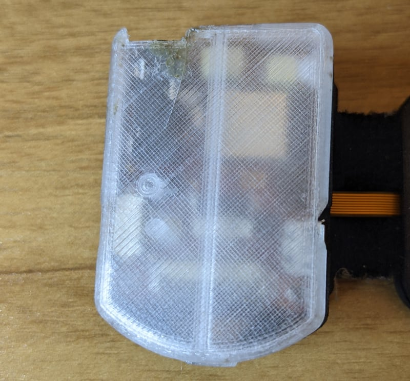
