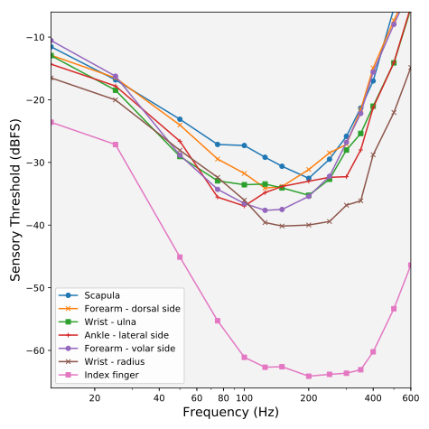

# Perceptual measurements

Analogous to [threshold of
hearing](https://en.wikipedia.org/wiki/Absolute_threshold_of_hearing)
measurements, we can characterize tactile perception by sensory threshold, the
minimum amplitude above which vibration is felt. This amplitude threshold varies
with:

 * vibration frequency
 * body place
 * [sensory adaptation](https://en.wikipedia.org/wiki/Neural_adaptation)
 * etc.

Understanding tactile perceptual limits is important for building effective
interfaces.

## Variation with body place

First, here is a summary of the sensory thresholds. The values shown are the
average sensory threshold over the 100&ndash;300 dB band (where sensitivity
tends to be best) in units of dB relative to full scale (dBFS). Smaller
values indicate greater sensitivity:

These are measurements I made on myself using Bekesy's tracking method with
the [Tactometer program](../tools/tactometer/index.md). I used a single Tectonic
TEAX13C02-8/RH tactor. Body places measured are the scapula acromion, dorsal
and volar sides of the forearm, ulnar and radial sides of the wrist joint,
lateral side of the ankle, and the index finger. Contact with the skin should
be secure but light, since putting pressure distorts the transducer's
response. I used tape as needed to keep the tactor in place.

In more detail, here are threshold vs. vibration frequency curves. Lower points
in the plot mean greater sensitivity.

Measurements are over 12.5 to 600 Hz. Each point is the average of at least 4
measurements.
