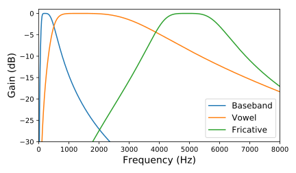
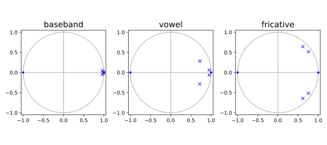

# Energy envelopes

## Overview

The [Enveloper
library](/src/tactile/enveloper.h)
computes energy envelopes over four bandpass channels of the input audio
signal:

* **Channel 0:** Baseband channel with 80&ndash;500 Hz sensitivity to capture
  low pitch harmonics, percussion, drums.

* **Channel 1:** Vowel channel, bandpassed to 500&ndash;3500 Hz to get speech
  formants, followed by an envelope with 500 Hz cutoff to get pitch rate.

* **Channel 2:** Sh fricative channel, bandpassed to 2500&ndash;3500 Hz followed
  by an envelope, to pick out postalveolar sounds like "sh" vs. other
  fricatives.

* **Channel 3:** Fricative channel, bandpassed to 4000&ndash;6000 Hz followed by
  an envelope, to capture frication noise.

For compression and onset emphasis, we apply a modified version of
per-channel energy normalization
to each tactor.

## Signal processing details

Frequency response of the bandpass filter for each channel (filters discretized
with sample rate = 44.1 kHz):

Pole-zero plots:

For each channel, audio is processed this way:

1. Bandpass energy computation.

   a. A 2nd order Butterworth bandpass filter is applied, implemented as two
      second-order sections.

   b. The signal is half-wave rectified and squared to obtain energy.

   c. A lowpass filter is applied to get an energy envelope.

   d. The eneryg envelope is decimated.

2. Automatic gain control with noise gating. We want to normalize speech and
   salient sounds toward 0 dB, yet we don't want to amplify noise. Our
   assumption is that the noise envelope changes slowly and that salient
   sounds are bursty and louder than the noise.

   a. A smoothed energy is computed using a one-pole smoother.

   b. To estimate the noise envelope, `FastLog2` of the smoothed energy is
      computed, then smoothed with a one-pole smoother in log space. By
      filtering in log space, the noise envelope focuses on small values and
      is less influenced by short bursts of energy in the signal.

   c. The noise gate threshold is computed by taking `FastExp2` of the noise
      envelope and multiplying by `thresh_factor`. The AGC gain is then
      computed based on x = smoothed energy, the threshold, and
      `agc_exponent`. For x &le; threshold, the gain is zero. For
      x much greater than the threshold, gain is approximately x^-agc_exponent.

   d. The gain is smoothed with an asymmetric smoother with fast attack.

   e. A normalized energy is computed by multiplying the energy by the
      smoothed gain. If needed, the smoothed gain is reduced so that the
      normalized energy does not exceed 1.0.

3. As in PCEN, the normalized energy is compressed with a power law as
   `(normalized_energy + delta)^exponent - delta^exponent`.

4. Final output is multiplied by a constant output gain factor.

A useful reference is [Praat Beginners'
Manual](http://ec-concord.ied.edu.hk/phonetics_and_phonology/wordpress/learning_website/praathome.htm),
chapters 2 and 3. It describes acoustic phonetics and spectrogram
characteristics of different categories of phones. Particularly, regarding
frequency bands:

* Nasals "n","m","ng" are in 200–450 Hz plus an F3 component around 2.5 kHz.
* For "HK speaker 2", vowels have F1 frequency in about 250–900 Hz, and F2 in
  850–2400 Hz, and F3 frequency is roughly around 3000 Hz, for a band of about
  250–3500 Hz for vowels. To reduce overlap on the low end with nasals, so
  restricting to 500–3500 Hz makes sense.
* For alveolar sibilants like "s","z" most energy is 3.5–10 kHz.
* Postalveolar sibilants like "sh" are lower, with most energy in 2–10 kHz.
