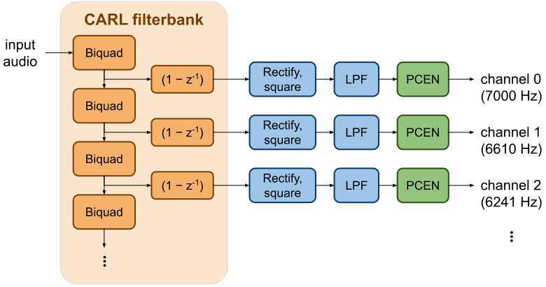

# CARL+PCEN frontend

CARL+PCEN, implemented in the [CarlFrontend
library](/src/frontend/carl_frontend.h),
is our frontend for performing [phonetic
analysis](../vowel_embedding/index.md). It begins with the Cascade of
Asymmetric Resonators, Linear (CARL). CARL is a bandpass filterbank and a
linear auditory filter model with an efficient cascaded structure. The CARL
filterbank is followed by
per-channel energy normalization (PCEN) compression.
We use the PCEN-compressed energies as input for 2-D vowel space embedding.

Example frontend output ("Ok Google, make me a sandwich"):

## CARL

CARL is an efficient linear filterbank of bandpass channels on an auditory
frequency scale, with spacing to the next channel proportional to the auditory
bandwidth at each channel. Channels are in decreasing frequency order.

The CARL filterbank is implemented as a cascade of biquad filter stages. The
resonant frequency decreases with each stage. The kth channel is formed by
taking the output after (k+1) stages, then applying a difference filter. For
efficiency, later stages of the cascade decimate the signal to successively
lower sample rates where possible.

## PCEN

After the CARL filterbank, we convert the bandpass outputs to energies by
half-wave rectification and squaring, then lowpass filter to obtain smooth
energy envelopes. The energy envelope for each channel is then compressed with
PCEN,

    pcen_output = (envelope / (γ + pcen_denom)^α + δ)^β − δ^β,

where `pcen_denom` is a lowpassed version of `envelope` and by default
α = 0.7, β = 0.2, γ = 10−12, δ = 0.001.

PCEN is a robust alternative to the log compression that is typically done in
speech frontends. We have previously used PCEN successfully in keyword spotting, 

> Yuxuan Wang, Pascal Getreuer, Thad Hughes, Richard F. Lyon, Rif A. Saurous,
> ["Trainable frontend for robust and far-field keyword spotting."](https://arxiv.org/abs/1607.05666)
> *In 2017 IEEE International Conference on Acoustics, Speech and Signal
> Processing (ICASSP)*, pp. 5670-5674. IEEE, 2017.
