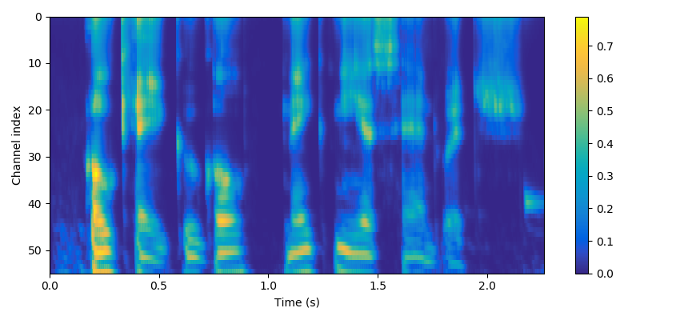
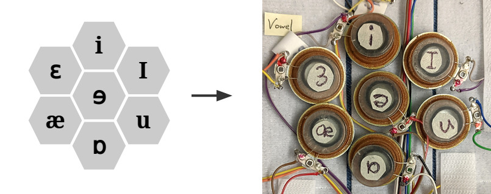

# Signal processing

This page describes the signal processing and ML for our
approach to audio-to-tactile representation.

Our processing has two aspects that we believe are valuable in conveying
speech. First, it extracts energy envelopes over four frequency bands,
capturing glottal pulses, vowel formants, and frication noise. Second, it
discriminates vowel sounds, mapping them to distinguishable tactile stimuli
patterns.

## TactileProcessor

[TactileProcessor](/src/tactile/tactile_processor.h)
implements our approach to audio-to-tactile signal processing. It takes audio
as input and produces tactile output in a cluster of 7 tactors is for
representing vowel sounds, and three additional tactors for fricative and
baseband (lower frequency) energy. We are also considering subsets and
variations of this for other form factors.

[Run TactileProcessor in the browser.](https://google.github.io/audio-to-tactile/demo/tactile_processor.html)

## Energy envelopes

[Details](energy_envelope/index.md)

We compute energy envelopes over four bandpass channels of the input audio
signal:

* **Channel 0:** Baseband channel with 80&ndash;500 Hz sensitivity to capture
  low pitch harmonics, percussion, drums.

* **Channel 1:** Vowel channel, bandpassed to 500&ndash;3500 Hz to get speech
  formants, followed by an envelope with 500 Hz cutoff to get pitch rate.

* **Channel 2:** Sh fricative channel, bandpassed to 2500&ndash;3500 Hz followed
  by an envelope, to pick out postalveolar sounds like "sh" vs. other
  fricatives.

* **Channel 3:** Fricative channel, bandpassed to 4000&ndash;6000 Hz followed by
  an envelope, to capture frication noise.

## CARL + PCEN frontend

[Details](frontend/index.md)

Our frontend for audio-to-tactile representation begins with the Cascade of
Asymmetric Resonators, Linear (CARL). CARL is a bandpass filterbank and a linear
auditory filter model with an efficient cascaded structure. The filterbank is
followed by
per-channel energy normalization (PCEN) compression,
as developed in

> Yuxuan Wang, Pascal Getreuer, Thad Hughes, Richard F. Lyon, Rif A. Saurous,
> ["Trainable frontend for robust and far-field keyword spotting."](https://arxiv.org/abs/1607.05666)
> *In 2017 IEEE International Conference on Acoustics, Speech and Signal
> Processing (ICASSP)*, pp. 5670-5674. IEEE, 2017.

We use the PCEN-compressed energies as input for 2-D vowel space embedding.

## 2-D vowel space embedding

[Details](vowel_embedding/index.md)

We developed a neural net that maps input audio to a 2D embedding where
different vowels are distinct.

We then present the 2D coordinate in a vibrotactile interface. The vowel
energy envelope is rendered on a cluster of seven hexagonally arranged
tactors, which we use as a small 2-D display. The soft classification of the
vowel is used to determine a 2D coordinate in this display. The coordinate is
presented continuously, interpolating the weight for fine sub-tactor
rendering. Only 2 or 3 tactors are activate at a given moment.

Despite being designed for vowels, the vowel representation provides some
help identifying consonants, for instance, nasals tend to have the same
spectral shape as "uw" and map to the same location. We can also imagine
extending this embedding approach to recognizing consonants.

## References

[Details](references/index.md)

Separately, we reimplemented several existing tactile communication schemes as
points of reference to compare to our own system.
We reimplemented several existing tactile communication schemes as points of
reference to compare to our own system:

 * [TAPS](references/taps/index.md)
 * [Bratakos et al. 2001](references/bratakos2001/index.md)
 * [Yuan et al. 2005](references/yuan2005/index.md)
