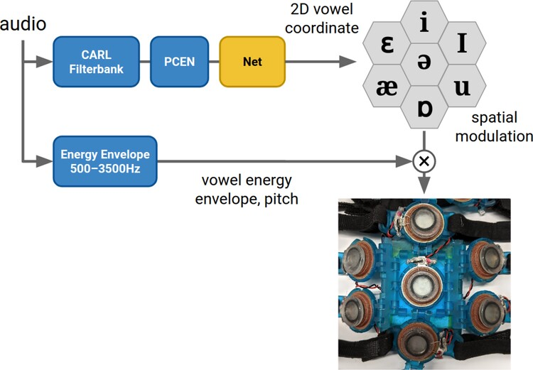
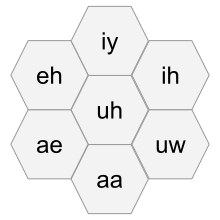
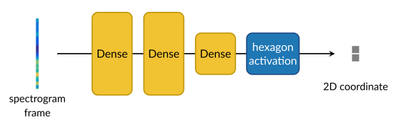
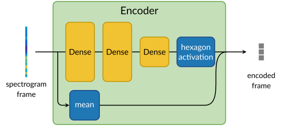
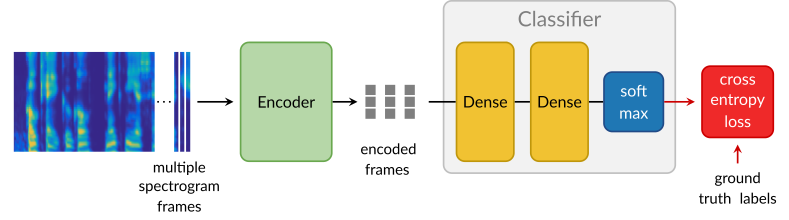
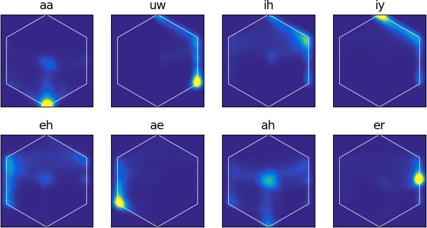
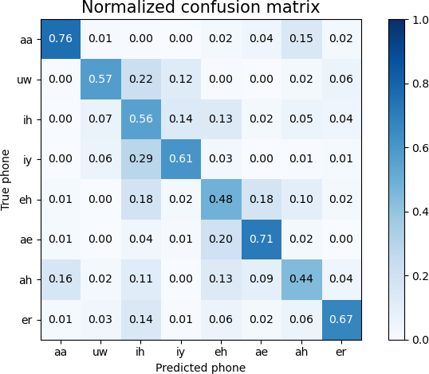

# Vowel embedding


## Overview

We developed a low-latency system that maps input audio into a 2D vowel space.
Different pure vowels,
[monophthongs](https://en.wikipedia.org/wiki/Monophthong), map to distinct
points in this space. This embedding is used to spatially modulate the vowel
channel energy envelope on the tactile interface, rendered on a hexagonally
arranged cluster of 7 tactors like a small 2D display. The wearer can then
identify the vowel by localizing the stimulus.

While we train the embedding on monophthong vowels alone, we apply the embedding
at inference time on all audio, including non-vowel and non-speech audio. This
way the system is not limited to audio, allowing the embedding to respond
however it does. We intentionally use a small network so that behavior outside
the training set is simple. Typically, a non-vowel input results in a moving
trajectory in the embedding. Our hope is that some non-vowel inputs are mapped
stably enough that a wearer could learn to recognize these trajectories, and we
do indeed see in preliminary studies that users can distinguish between some
consonants with this system.

Besides tactile interfaces, another potential application is audio
visualization, by plotting the embedding as a heatmap. This could be useful for
instance as a tool for feedback on one's own pronunciation.

## System



We use the [CARL+PCEN frontend](../frontend/index.md) to analyze the input audio
to bandpass energies to form the input for a small network. The output of the
network is a 2D vowel coordinate. We spatially modulate the [vowel channel
energy envelope](../energy_envelope/index.md) at this coordinate on
the cluster of 7 tactors. The spatial modulation is done continuously with
respect to the coordinate by weighting piecewise linearly over the tactors. We
do "subtactor rendering" instead of snapping to the closest tactor.

## Embedding network

[Monophthong vowels](https://en.wikipedia.org/wiki/Monophthong)
are often represented as points in a 2D vowel space with articulatory
"front-back" and "open-close" dimensions as in this table:

            Front   Central   Back        Code   Example    Code   Example
          +-------+---------+------+      aa     bott       ih     bit
    Close |  iy   |   ih    |  uw  |      ae     bat        iy     beet
          +-------+---------+------+      ah     but        uh     book
    Mid   | eh,er |  ah,uh  |      |      eh     bet        uw     boot
          +-------+---------+------+      er     bird
    Open  |  ae   |         |  aa  |
          +-------+---------+------+


Codes `aa`, `iy`, etc. are [ARPAbet phonetic
codes](https://en.wikipedia.org/wiki/ARPABET). Diphthongs are represented as
sounds that move between two points in this space.

Our network maps into a space with vowels arranged angularly so that
the resulting coordinate can map onto a hexagonal grid of 7 tactors:

<p></p>


### Inference

At inference time, the embedding network is 3 fully-connected layers. The last
layer is a bottleneck with 2 units to embed the frame as a 2D coordinate.

<p></p>

To constrain the embedded 2D coordinate to the hexagon, we apply a special
"hexagon activation", computed as

```{.py}
r = HexagonNorm(x, y)
x *= tanh(r) / r
y *= tanh(r) / r
```

and `HexagonNorm(x, y)` is a hexagonally-warped version of the Euclidean norm:

<p></p>

The effect is the activation maps any 2D coordinate in $$\mathbb{R}^2$$
inside the hexagon.


### Training

We use an encoder-decoder structure to train the embedding.
The decoder tries to classify the phone from the encoding. The decoder
simulates the human wearing of the
audio-to-tactile
interface, who tries to understand
speech from the tactile signals. The decoder's degree of success gives a sense
of how easily a human might understand the embedding.

During training, we concatenate the mean of the frame as a third dimension to
the embedding. This extra dimension is meant as a proxy for the information in
the energy envelope.

<p></p>

To give the decoder temporal context, we run 3 consecutive frames through
the encoder, concatenate them, and feed the resulting 9D vector as input to the
decoder. The decoder output is a vector of softmax classification scores for the
8 monophthong vowel classes aa, uw, ih, iy, eh, ae, ah, er.

<p></p>

We use regularizing penalties on the layer weights and to encourage the
embedding to map particular classes to particular target points.
We use TIMIT for training data.

### Evaluation

What we care about is how well the network helps the user distinguish the
different vowels. Preliminary studies show that
users distinguish many of the vowel pairs with a d-prime of roughly 2.0,
while some are under 1.0. We are working on testing this in more detail.

We evaluate the embedding by plotting the 2D histograms of how each vowel is
mapped over the examples in the TIMIT test set. These distributions should have
minimal overlap to produce a distinct percept.



The distributions are concentrated around the training targets, approximating
the above hexagon diagram.

As a proxy for the human user, we also evaluate the classification network.



Summary metrics (higher is better):

 * mean d-prime: 1.7560
 * information transfer: 1.27
 * mean per class accuracy: 0.6006

One-vs-all d-prime values for each phone (higher is better):

<table><tr><th>phone</th><th>d-prime</th></tr>
<tr><td>aa</td><td>2.4843</td></tr>
<tr><td>uw</td><td>1.6782</td></tr>
<tr><td>ih</td><td>1.0642</td></tr>
<tr><td>iy</td><td>2.1163</td></tr>
<tr><td>eh</td><td>1.3913</td></tr>
<tr><td>ae</td><td>2.1268</td></tr>
<tr><td>ah</td><td>1.2574</td></tr>
<tr><td>er</td><td>1.9296</td></tr>
</table>
