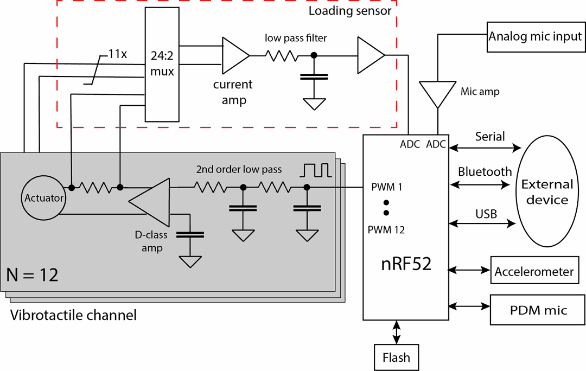

# Tutorial on tactile output options.

This tutorial explains three ways to output tactile signals on the actuators.

We recommend using LRAs or voice coils. We have not tested with ERM actuators,
they should work, but they need a different drive signal.

We are using 12 PWM channels on the microcontroller to create tactile signals,
as shown in the block diagram below. This allows us to drive 12 simultaneous
signals. The PWM is converted to analog waveforms with a low-pass filter. The
analog waveform goes into the audio class-D amplifier, which drives the
actuators directly.

In all cases, the VHP board should be connected to an external power supply or a
battery. Powering only with USB is unreliable since the board might need over 1
amp of power, causing the USB port to disconnect.

## Editing low-level buffer

The
[simple_tactile_output](/examples/slim/simple_tactile_output/simple_tactile_output.ino)
example sketch shows the basic functionality of the tactile library. Each PWM
channel has 8 registers, which are played in sequence. For example, a sin wave
can be created by setting registers to: `static uint16_t sin_wave[8] =
{256,437,512,437,256,75,0,75};`

Then, those registers are loaded into the PWM buffer by calling:
`SleeveTactors.UpdateChannel(c, sin_wave);`

Right before the 8 registers are finished playing, `OnPwmSequenceEnd()` is
triggered. In that callback, the registers can be modified, allowing for the
full control of the playback. If no changes are made, the existing registers
will be played infinitely. We leverage this callback in the second and third
options below, as well as in audio-to-tactile firmware. The playback can be
stopped by setting the registers to zero: `static uint16_t silence[8] = {0};`
`SleeveTactors.UpdateChannel(c, silence);`

Each register is repeatedly played 8 times by default, and the original
frequency is 2000 Hz. So resulting output sine wave frequency will be around 250
Hz (2000 Hz / 8). This frequency This can be modified with
`SetUpsamplingFactor(n)`. Higher n will decrease the frequency, and lowering it
increases the frequency.

## Using the patterns library.

The patterns library can be used to control the haptic output on a higher level.
The pattern library can generate tactile signals such as sin waves. See
[tactile_patterns](/examples/slim/tactile_patterns/tactile_patterns.ino)
example for more details. We recommend using extended tactile patterns, since
they allow to control of each actuator individually.

## Using USB streaming from PC.

Using this python script the data in the form of a 12 channel wav file could be
streamed as tactile output. In this firmware, a new data buffer is loaded just
in time when `OnPwmSequenceEnd()` is called.

The tactile data could be generated in audio editing programs such as Audacity.
The file should be set to 2000 Hz sampling and 16-bit signed PCM. Here is an
example of
[wav file](https://drive.google.com/file/d/1pEqzu_WwXcCxanmt6KgyjA5EGZ_RKl1l/view?usp=sharing)
and the corresponding
[Audacity project](https://drive.google.com/file/d/1a78jSiW5OTphLA-xM-3GGjn4SZuZzxTx/view?usp=sharing).
The wav file should end with silence, otherwise actuators will just keep playing
back the last sequence.

Steps to get USB streaming working as follows:

1. Flash the
[streaming_slim](/examples/slim/streaming_slim/streaming_slim.ino)
firmware to the VHP board, found in examples.

2. Install Python serial port with a terminal command `pip install pyserial`.

3. Run the
[play_wav.py](/extras/streaming/play_wav.py)
script on the computer.
