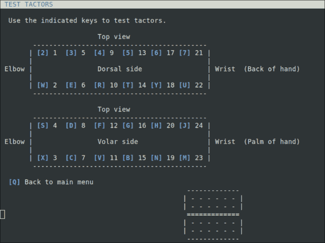
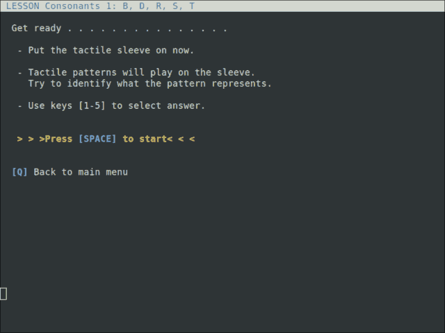
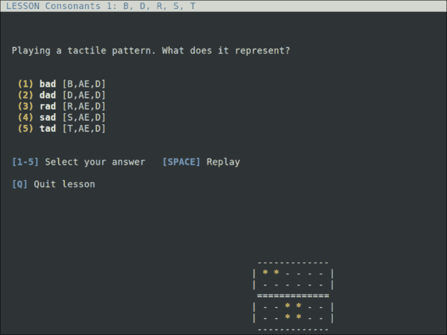

[Audio-to-Tactile Representation](../../README.md)

# Tactophone - TAPS sleeve training game

`tactophone` is a training game for TActile Phonemic Sleeve (TAPS), a system of
24-channel phonemic codes described in

> Charlotte M. Reed, Hong Z. Tan, Zachary D. Perez, E. Courtenay Wilson,
> Frederico M. Severgnini, Jaehong Jung, Juan S. Martinez, Yang Jiao, Ali
> Israr, Frances Lau, Keith Klumb, Robert Turcott, Freddy Abnousi, ["A
> Phonemic-Based Tactile Display for Speech
> Communication,"](https://doi.org/10.1109/TOH.2018.2861010) *IEEE Transactions
> on Haptics*, 2018.

Speech is represented in terms of 39 phonemes. Each phoneme is encoded as a
distinct vibrotactile pattern.

## Hardware

Tactophone is intended to be used with a tactile sleeve as described in the
Reed et al. work linked above.


See the main page for more details.


## Building the Tactophone program

Tactophone is implemented in C and depends on the
[pthreads](https://pubs.opengroup.org/onlinepubs/7908799/xsh/pthread.h.html),
[ncurses](https://www.gnu.org/software/ncurses/ncurses.html), and
[PortAudio](http://www.portaudio.com/) libraries. On Debian-based systems, use

``` shell
sudo apt-get install libncurses-dev portaudio19-dev
```

to install development headers for these libraries. Then build Tactophone with

``` shell
bazel build -c opt extras/references/taps:tactophone_main
```

This should produce an executable file
`bazel-bin/extras/references/taps/tactophone_main`.

## First time set up
Some first time set up is needed to find the right output audio device and to map
the order of the 24 channels from Purdue's order to your hardware.

### Identify the output device

Make sure the output device is connected and turned on. Run the Tactophone
program with `--output=-1`:

``` shell
bazel-bin/extras/references/taps/tactophone_main --output=-1
```

The program will print a list of detected audio devices. Find the desired device
and note the number next to it. If the device is not listed, double-check that
the device is on, unplug and replug the USB connection, and rerun the above
command.

### Channel mapping

Run the program setting `--output` with the number for the desired device, e.g.

``` shell
bazel-bin/extras/references/taps/tactophone_main --output=6
```

This should show the Tactophone main menu. Press the `[T]` button to enter the
Test Tactors screen.


The Test Tactors screen shows the following ASCII art diagram of the sleeve.



The numbers 1-24 show how Purdue's channel order correspond to locations on the
sleeve. The letter in square brackets is a keyboard button to test that channel
by playing a 200Hz sinusoid to it. For instance the `[U]` button tests channel
22, where the intended location is at the right side, wrist end of the sleeve.

However, chances are that your hardware channels are in some other order, and
need to be reordered to match Purdue's. To do this, use the following procedure:

Press the `[2]` button to test channel 1. Notice on the sleeve which tactor is
activated. (If no tactor is activated, or if more than one tactor is active,
there is likely a hardware problem.) Note the location as numbered in the
diagram of the activated tactor. For instance, if channel 1 activates the tactor
at Purdue's location 20, then write down 20.

Next, pressing the `[W]` button, repeat the above for channel 2. Continue
testing the channels in order (`[X]`, `[S]`, `[3]`, etc.), writing down the
Purdue's location number corresponding to each channel.

At the end we have a list of 24 numbers. For example
`20,24,23,19,15,11,7,3,13,9,5,1,4,8,12,16,2,6,10,14,18,22,21,17`, which means
channel 1 maps to Purdue's location 20, channel 2 maps to Purdue's 24, etc.

Press `[Q]` repeatedly to quit Tactophone. Rerun it using `--channels` to set
the channel mapping (as a comma-delimited list of numbers, without spaces):

``` shell
bazel-bin/extras/references/taps/tactophone_main --output=6 \
  --channels=20,24,23,19,15,11,7,3,13,9,5,1,4,8,12,16,2,6,10,14,18,22,21,17
```

Press `[T]` to go to the Test Tactors screen again, and test each button `[2]`,
`[W]`, etc. to verify the channel mapping. If the mapping is correct, then each
button should activate the tactor at the indicated position.

Finally, if needed, use the `--channel_gains_db` option to tune Tactophone's
gain for each output channel. This option is a comma-delimited list of gains in
decibels. The more negative the value, the lower the signal level. For instance,
`--channel_gains_db=-10.3,-6` sets the gain for channel 1 to -10.3 dB and the
gain for channel 2 to -6 dB (and the unspecified channels 3-24 have gain 0 dB).
The Free Play screen (`[F]` from the main menu) and Test Tactors screen (`[T]`
from the main menu) are useful to test whether gains are set appropriately.

Now Tactophone is ready to use! For future runs, note your settings of
`--output`, `--channels`, and `--channel_gains_db`. You could save them for
instance in a small shell script like

*run_tactophone.sh*
``` shell
#!/bin/bash
bazel-bin/extras/references/taps/tactophone_main --output=6 \
  --channels=20,24,23,19,15,11,7,3,13,9,5,1,4,8,12,16,2,6,10,14,18,22,21,17 "$@"
```


## Training with Tactophone

This section walks through taking a lesson in Tactophone. Each lesson focuses on
learning a few phoneme codes at a time.

1. Start Tactophone with `--output` and `--channels` as described in the
   previous section.

2. The main menu lists the lessons. Press `[1]` to run the first lesson.

   

3. Put on the sleeve and get ready. Press the spacebar button to start the first trial.

   

4. A tactile pattern will play on the sleeve. What does it mean? On the first
   try, this is of course an  an unfair question. Select a choice with `[1-5]`
   to proceed.

   

5. After selecting a choice, Tactophone enters a review mode. Here, you can
   press `[1-5]` to play and compare tactile signals for each choice. When
   ready, press spacebar to continue to another trial.

   

6. After enough trials, the lesson ends. A lesson summary with accuracy and
   other stats is shown. Your accuracy is probably not good on first play
   through, but you will improve---that's what this game is for! Press spacebar
   to go back to the main menu.

   

7. From here, you can retake the first lesson---try to improve your accuracy and
   speed---or try other lessons to learn other phonemes.


## Other features and details

### tactophone command line options

 * `--output=<int>` - Sets the PortAudio output device number. If not specified,
   tactophone prints a numbered list of connected devices.

 * `--lessons=<filename>` - Lesson file to read (default `lessons.txt`).

 * `--log=<filename>` - Log file to write (default `tactophone.log`).

 * `--channels=<list>` - Specifies the channel order. The list should be a
   comma-delimited sequence of integers between 1 and 24.

 * `--channel_gains_db=<list>` - Sets the gain for each channel in decibels.


### Free play mode

In the main menu, press `[F]` to enter "free play" mode.


Here you can play the tactile code for any phoneme. This is useful for comparing
phonemes, e.g. for D vs. T, where the difference is subtle.


### Log of training history

Tactophone records training activity to a log file. The file is `tactophone.log`
by default, or can be set when starting tactophone with `--log=path/name.log`.

Example:

    128 15:51:41] SetLesson lesson=0 (Consonants 1: B, D, R, S, T)
    143 15:51:42] NextTrial lesson=0, question=6, num_choices=5
    143 15:51:42] PlayPhonemes R,EH,D
    192 15:51:45] SelectChoice selected=2, correct=2 (read vs. read)
    202 15:51:45] NextTrial lesson=0, question=0, num_choices=5
    202 15:51:45] PlayPhonemes T,EH,L
    243 15:51:47] SelectChoice selected=0, correct=4 (bail vs. tail)

To facilitate automated parsing and analysis, each log statement begins with the
number of 50ms clock ticks since startup, followed by a timestamp, an event
identifier (e.g. `NextTrial`), and finally details of the event. Difference of
clock ticks can be used to calculate response times. For instance in the log
above, the response time was 50ms &sdot; (192 &minus; 143) = 2.45s on the first
trial and 50ms &sdot; (243 &minus; 202) = 2.05s on the second trial.

NOTE: The log can be used to cheat. It should not be viewed while taking a
lesson.


### Lessons file

Tactophone reads the lesson material from the file lessons.txt, or another can
be specified by setting `--lessons=path/lessons.txt` when running tactophone.
You can modify and extend Tactophone by editing this file. For instance, you
could create lessons to exercise particular words, or material for a foreign
language.

The lessons file has a basic text format. An example lesson file, defining two
lessons:

    # Lines starting with '#' are comments.

    # Define a lesson called "Consonants 1: B, D, R, S, T" with 3 questions.
    lesson Consonants 1: B, D, R, S, T
    question bail;B,EH,L dale;D,EH,L rail;R,EH,L sail;S,EH,L tail;T,EH,L
    question bore;B,AW,R door;D,AW,R roar;R,AW,R sore;S,AW,R tore;T,AW,R
    question bun;B,ER,N done;D,ER,N run;R,ER,N sun;S,ER,N ton;T,ER,N

    # Define a lesson with 2 questions.
    lesson Vowels 1: AE, AH, AY, EE, IH
    question bat;B,AE,T bot;B,AH,T bait;B,AY,T beet;B,EE,T bit;B,IH,T
    question cap;K,AE,P cop;K,AH,P cape;K,AY,P keep;K,EE,P kip;K,IH,P

A line `lesson <name>` defines a new lesson and its name. A line starting
with `question` defines a question under the current lesson. The syntax of
a question is a space-delimited list of choices in the form

    question <label1>;<phonemes1> <label2>;<phonemes2> ...


## Implementation

Summary of code organization:

 * `phoneme_code.{h,c}` - Defines the tactile signals for each phoneme.
 * `tactophone.{h,c}` - Tactophone() function that starts PortAudio and ncurses and runs the game.
 * `tactophone_engine.{h,c}` - Tactophone engine for event handling and Tactophone game variables.
 * `tactophone_lesson.{h,c}` - Lesson datastructures and parsing.
 * `tactophone_main.c` - Main program for the Tactophone phoneme training game.
 * `tactophone_state_main_menu.c` - Implements the main menu.
 * `tactophone_state_begin_lesson.c` - Shows instructions at the beginning of a lesson.
 * `tactophone_state_lesson_trial.c` - Plays a pattern, asks what it is.
 * `tactophone_state_lesson_review.c` - Shows answer and allows comparison.
 * `tactophone_state_lesson_done.c` - Shows accuracy and other stats.
 * `tactophone_state_free_play.c` - Phoneme "free play" screen.
 * `tactophone_state_test_tactors.c` - "Test tactors" screen.
 * `tactile_player.{h,c}` - Fire-and-forget playback of tactile signals.
 * `util.{h,c}` - Miscellaneous utilities for tactile processing.
 * `logging.h` - `CHECK` and `CHECK_NOTNULL` macros.

To modify the tactile signals, look at the phoneme_code.c file. For instance,
the "EE" phoneme code is generated by the function

``` c
void PhonemeEE(float t, float* frame)
```

which takes a time `t` in units of seconds as input and writes a frame of 24
samples to `frame[0]`, ..., `frame[23]` in Purdue's channel order. Other phoneme
codes are similar. A table `kPhonemeCodebook` in phoneme_code.c defines the
duration for each code.

To modify the UI or create a new UI, look at the tactophone_state_\*.c files.
Different UI screens are implemented as different "states", e.g. main menu vs.
lesson trials. A state is defined by three event-handler callbacks,
on_enter_state, on_key_press, and on_tick. Tactophone uses the ncurses library
to "draw" the UI text display.
