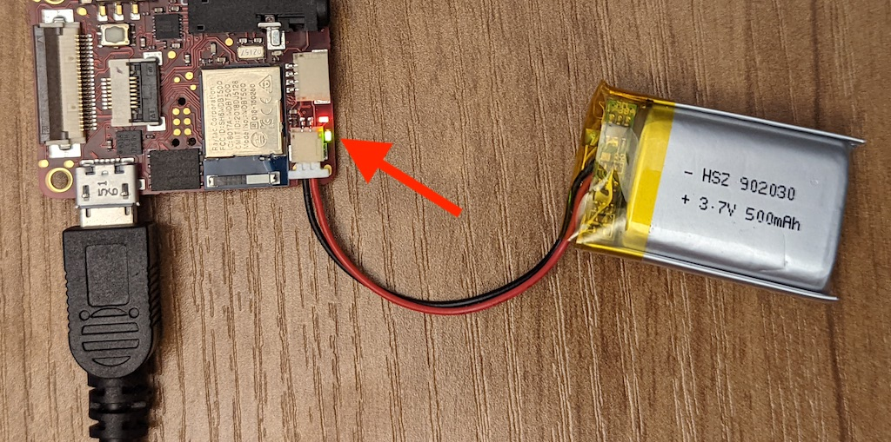

# VHP Quick Start Guide

This page provides an instruction manual for getting started with the VHP
(Vibrotactile Haptics Platform) electronics. More details on VHP can be found in
UIST'21 (User Interfaces and Software Technology) conference
[paper](https://dl.acm.org/doi/pdf/10.1145/3472749.3474772)

If you are interested and have ideas about using VHP or want to receive updates,
please fill out this
[form](https://sites.google.com/corp/view/vhp-collaborations/home).


## Powering up

To turn on the board use the slide switch on the side of the board. The board
can be powered from USB, however, this might not provide enough current if
vibrotactile output is attached. So, the board should be powered over a JST-SH
connector with a lithium polymer battery or a power supply (3.8&ndash;4.2 V) .
The battery size should be at least 500 mAH if multiple tactile channels are
used.

## Charging

The device has an on-board battery charger. When plugging in the micro USB and a
battery into JST-SH connector, battery will charge. There are red and green
lights next to the USB port. Red means USB power is good. Green light will turn
off when charging is done.



## Programming with Arduino

Using the micro-USB and Arduino bootloader is the most convenient way to program
the VHP board. It should already be flashed with the bootloader, so you should
see it as a virtual com port in Arduino. You can also program with J-link, in
case the bootloader gets corrupted or there is some kind of fatal error in the
code. For detailed instructions see [programming guide](../firmware/index.md).

## Streaming haptic waveforms from the PC

The wav audio files could be played back on the actuators. The wav file could be
generated in [Audacity](https://www.audacityteam.org/). The project rate should
be set to 2000 Hz, 16-bit PCM, and number of channels set to 12. An example
Audacity project zip and corresponsing wav file can be found
[here](play_all_channels_one_by_one.zip).

1.  Flash the
    [streaming_slim.ino](/examples/streaming_slim/streaming_slim.ino)
    sketch, which implements continuous streaming.
2.  Connect the board to the PC with Micro-USB.

3.  Use the python script
    [(extras/streaming/play_wav.py)](/extras/streaming/play_wav.py)
    to play the file. Run in the terminal: `python play_wav.py -wav_file_path
    -serial_port_number`. Where, a number should be placed for the serial port.
    To enumerate ports, run the above python script, and you should see an
    output like this:

    ```sh
    [ 0 ] /dev/cu.BLTH - n/a
    [ 1 ] /dev/cu.usbmodem0006832220631 - J-Link - CDC DATA interface
    [ 2 ] /dev/cu.usbmodem14131301 - Feather nRF52840 Express
    ```

    In this example use port 2 (Feather nRF52840 Express). This script was
    optimized for Mac, and might not run as well on Windows / Linux, since the
    timing of USB driver could be different.

4.  The blue LED light should start blinking and the data should be played on
    the actuators.

## Current sensing

Each vibrotactile channel has a current sensing ability. This feature is still
experimental. To test this feature you can do the following:

1.  Flash the
    [current_sensing_one_channel.ino](/examples/slim/current_sensing_one_channel/current_sensing_one_channel.ino)
    sketch.

2.  Open the Arduino Serial plotter.

3.  Press *'a'* to enable the actuator and *'s'* to disable it ('a' = activate,
    's' = silence). When touching the actuator you should see a consistent
    change of current.

If you want to sense multiple channels, see the
[current_sensing_multi_channel.ino](/examples/slim/current_sensing_multi_channel/current_sensing_multi_channel.ino)
sketch. Depending on the number of channels multiplexing many channels can get
slow.
